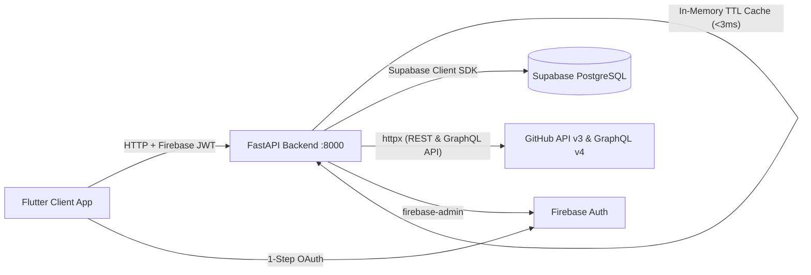

# 🚀 Repo Dog

A modern, cross-platform developer workspace and GitHub tracker built with **Flutter**, **FastAPI**, **Supabase**, **GitHub REST & GraphQL APIs**, and **Firebase Authentication**.

Repo Dog unifies your entire GitHub footprint — profile metadata, profile README, repository lists, branch intelligence, commit histories, contribution activity heatmaps, PRs, CI/CD runs, and repository READMEs — into a single, high-performance GitHub dark-themed dashboard.

---

## 🏗️ Architecture Overview



---

## ✨ Key Features

- **⚡ Ultra-Fast Double-Layer Caching Engine**:
  - **Backend TTL Cache (`SimpleTTLCache`)**: 5-minute in-memory response cache bringing API response times down to **<3ms**.
  - **Frontend State Retention (`ref.keepAlive()`)**: 0ms instant tab switching across **DashBoard**, **All Repo**, **Description**, and **Setting**.
  - **Smart Invalidation**: Triggers clean cache purges automatically when a GitHub sync is executed.
- **🎨 GitHub Dark UI Aesthetic**: Tailored GitHub Dark theme (`#0D1117` canvas, `#161B22` sidebar, `#30363D` borders, `#58A6FF` accent blue, `#3FB950` contribution green).
- **🔑 1-Step GitHub Sign-In**: Seamless authentication via Firebase GitHub OAuth across Web, Android, and Desktop.
- **📈 Real GraphQL Contribution Heatmap**: Fetches exact contribution calendar from GitHub GraphQL API (`contributionsCollection.contributionCalendar`), displaying total contributions (*e.g., 249 contributions in the last year*) and daily contribution green intensity grid.
- **📦 All Repositories Explorer**: Filter repositories by **All**, **Public**, **Private**, or **Starred** with instant search, primary language dots, star/fork metrics, and relative update timestamps (*Updated 17m ago*).
- **📖 Live Repository README.md Viewer**: Displays full formatted Markdown for any repository directly inside the Overview tab.
- **🌱 Deduplicated Branch Intelligence**: Real-time list of repository branches sorted with Default branch first, exact UTC commit timestamps, and stale branch detection (`STALE >30d`).
- **👤 User Profile & Description (`/description`)**: Renders full GitHub profile metadata (*display name, bio, follower/following counts, social & website links*) alongside your special **GitHub Profile README.md** (`username/username`).
- **⚙️ Active Settings Workspace (`/settings`)**:
  - **Force Re-Sync Engine**: Interactive manual sync trigger with live progress feedback.
  - **Background Sync Frequency**: Switch polling intervals (`Every 15 Mins`, `1 Hour`, `6 Hours`, `Manual Only`).
  - **Stale Branch Threshold Slider**: Adjustable cutoff from `7` to `90` days.
  - **Live API Health Monitor**: Real-time server status badge (`🟢 API Online`).
  - **Sign Out Confirmation**: Modal dialog protection against accidental logouts.
- **🔒 Enterprise Security**: GitHub OAuth access tokens are encrypted at rest using Fernet symmetric encryption before storing in Supabase.

---

## 🛠️ Technology Stack

| Layer | Technologies |
| :--- | :--- |
| **Frontend** | Flutter 3.x, Flutter Riverpod, GoRouter, Dio, Google Fonts (Outfit & Inter), Flutter Markdown |
| **Backend** | Python 3.11+, FastAPI, Uvicorn, httpx, Cryptography (Fernet), In-Memory TTL Cache |
| **APIs** | GitHub REST API v3 & GitHub GraphQL API v4 |
| **Database** | Supabase PostgreSQL (RLS-enabled schema) |
| **Auth** | Firebase Auth (GitHub OAuth Provider) |

---

## 📂 Project Structure

```
Repo Dog/
├── app/                        # Flutter multi-platform application
│   ├── android/                # Android native project & google-services.json
│   ├── lib/
│   │   ├── core/
│   │   │   ├── constants/      # ApiConstants (Base URL & Endpoint Routes)
│   │   │   ├── layout/         # AppShell (Persistent GitHub Dark Sidebar & Modal Confirmations)
│   │   │   ├── network/        # Dio Client & Firebase Auth Interceptor
│   │   │   ├── router/         # GoRouter navigation & route guards
│   │   │   └── theme/          # GitHub Dark Theme design system
│   │   ├── features/
│   │   │   ├── auth/           # AuthNotifier, LoginScreen, SyncLoadingScreen
│   │   │   ├── dashboard/      # DashboardScreen (Stats, Starred/Recent Repos, Heatmap)
│   │   │   ├── profile/        # DescriptionScreen (Profile Metadata & Profile README)
│   │   │   ├── projects/       # ProjectsScreen & ProjectDetailScreen (README & Branches)
│   │   │   └── settings/       # SettingsScreen (Sync Engine, Preferences, Stale Rules)
│   │   └── firebase_options.dart # Auto-generated FlutterFire configuration
│   └── pubspec.yaml            # Flutter dependencies
│
├── backend/                    # FastAPI Backend Service
│   ├── app/
│   │   ├── core/               # Config, Cache (TTL Engine), Security (Fernet), Supabase Client
│   │   ├── routers/            # Auth, Dashboard, Projects, User, Settings, Sync API endpoints
│   │   ├── services/           # GitHubSyncService (REST & GraphQL sync engine)
│   │   └── main.py             # FastAPI entrypoint & CORS configuration
│   ├── .env                    # Environment configuration
│   └── requirements.txt        # Python dependencies
│
└── supabase/
    └── migrations/             # Initial database schema SQL
```

---

## ⚡ Quick Start Guide

### 1. Backend Setup (FastAPI)

```powershell
# Navigate to backend directory
cd backend

# Install dependencies
pip install -r requirements.txt

# Start the API dev server on port 8000
python -m uvicorn app.main:app --host 0.0.0.0 --port 8000 --reload
```

### 2. Frontend Setup (Flutter)

```powershell
# Navigate to app directory
cd app

# Install dependencies
flutter pub get
```

---

## 📱 Running Across Platforms

### 🌐 Web (Chrome)
```powershell
cd app
flutter run -d chrome
```

### 📱 Android Device
```powershell
# Forward port 8000 from phone over USB
& "C:\Users\15bha\AppData\Local\Android\Sdk\platform-tools\adb.exe" reverse tcp:8000 tcp:8000

cd app
flutter run -d android
```

### 💻 Windows Desktop
```powershell
cd app
flutter run -d windows
```

---

## 🔒 Environment Configuration (`backend/.env`)

```env
FIREBASE_PROJECT_ID=repo-dog
FIREBASE_SERVICE_ACCOUNT_JSON=serviceAccountKey.json

SUPABASE_URL=https://your-project.supabase.co
SUPABASE_SERVICE_ROLE_KEY=your-supabase-service-role-key

GITHUB_OAUTH_CLIENT_ID=your-github-client-id
GITHUB_OAUTH_CLIENT_SECRET=your-github-client-secret

TOKEN_ENCRYPTION_KEY=your-fernet-encryption-key
```
