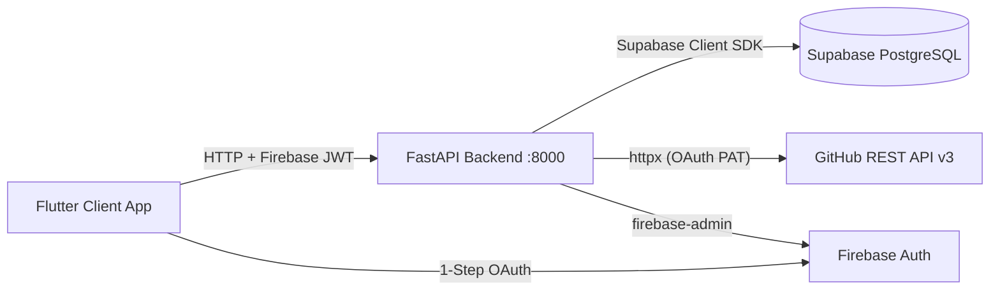

# 🚀 Repo Dog

A modern, cross-platform developer hub and GitHub management dashboard built with **Flutter**, **FastAPI**, **Supabase**, and **Firebase Authentication**.

Repo Dog unifies your GitHub activity (repositories, branches, commits, pull requests, issues, and GitHub Actions CI runs) into a single, dark-themed developer workspace.

---

## 🏗️ Architecture Overview



---

## ✨ Key Features

- **⚡ 1-Step GitHub Sign-In**: Seamless authentication via Firebase GitHub OAuth across Web, Android, and Desktop.
- **🔄 Live Sync Experience**: Dedicated animated loading screen (`/syncing`) with live step-by-step progress tracking (*Authentication → Repositories → Branches → Commits → PRs → Workflows*).
- **📊 Real-time Dashboard**: Overview metrics (Total Repos, Open PRs, Failing CI Runs, Active Branches) and recent repository listings.
- **🔍 5-Tab Repository Detail View**: Deep dive into individual project details across Overview, Branches (stale branch detection), Issues & PRs, GitHub Actions Workflows, and App-native Notes & Goals.
- **🔐 Enterprise Token Encryption**: GitHub OAuth access tokens are encrypted at rest using Fernet symmetric encryption before storing in Supabase.

---

## 🛠️ Technology Stack

| Layer | Technologies |
| :--- | :--- |
| **Frontend** | Flutter 3.x, Flutter Riverpod, GoRouter, Dio, Google Fonts (Outfit & Inter) |
| **Backend** | Python 3.11+, FastAPI, Uvicorn, httpx, Cryptography (Fernet) |
| **Database** | Supabase PostgreSQL (RLS-enabled schema) |
| **Auth** | Firebase Auth (GitHub OAuth Provider) |

---

## 📂 Project Structure

```
Repo Dog/
├── app/                        # Flutter multi-platform application
│   ├── android/                # Android native project & google-services.json
│   ├── lib/
│   │   ├── core/
│   │   │   ├── constants/      # ApiConstants (Base URL & Routes)
│   │   │   ├── network/        # Dio Client & Firebase Auth Interceptor
│   │   │   ├── router/         # GoRouter navigation & route guards
│   │   │   └── theme/          # Dark Theme aesthetic design system
│   │   ├── features/
│   │   │   ├── auth/           # AuthNotifier, LoginScreen, SyncLoadingScreen
│   │   │   ├── dashboard/      # Metrics Overview & Recent Repositories
│   │   │   └── projects/       # ProjectsScreen & ProjectDetailScreen
│   │   └── firebase_options.dart # Auto-generated FlutterFire configuration
│   └── pubspec.yaml            # Flutter dependencies
│
├── backend/                    # FastAPI Backend Service
│   ├── app/
│   │   ├── core/               # Config, Security (Fernet), Supabase Client
│   │   ├── routers/            # Auth, Dashboard, Projects, Sync API endpoints
│   │   ├── services/           # GitHubSyncService (REST API sync engine)
│   │   └── main.py             # FastAPI entrypoint & CORS configuration
│   ├── .env                    # Environment configuration
│   └── requirements.txt        # Python dependencies
│
└── supabase/
    └── migrations/             # Initial database schema SQL
```

---

## ⚡ Quick Start Guide

### 1. Backend Setup (FastAPI)

```powershell
# Navigate to backend directory
cd backend

# Install dependencies
pip install -r requirements.txt

# Start the API dev server on port 8000
python -m uvicorn app.main:app --host 0.0.0.0 --port 8000 --reload
```

### 2. Frontend Setup (Flutter)

```powershell
# Navigate to app directory
cd app

# Install dependencies
flutter pub get
```

---

## 📱 Running Across Platforms

### 🌐 Web (Chrome)
```powershell
cd app
flutter run -d chrome
```

### 📱 Android Device
```powershell
# Forward port 8000 from phone over USB
& "C:\Users\15bha\AppData\Local\Android\Sdk\platform-tools\adb.exe" reverse tcp:8000 tcp:8000

cd app
flutter run -d android
```

### 💻 Windows Desktop
```powershell
cd app
flutter run -d windows
```

---

## 🔒 Environment Configuration (`backend/.env`)

```env
FIREBASE_PROJECT_ID=repo-dog
FIREBASE_SERVICE_ACCOUNT_JSON=serviceAccountKey.json

SUPABASE_URL=https://your-project.supabase.co
SUPABASE_SERVICE_ROLE_KEY=your-supabase-service-role-key

GITHUB_OAUTH_CLIENT_ID=your-github-client-id
GITHUB_OAUTH_CLIENT_SECRET=your-github-client-secret

TOKEN_ENCRYPTION_KEY=your-fernet-encryption-key
```
