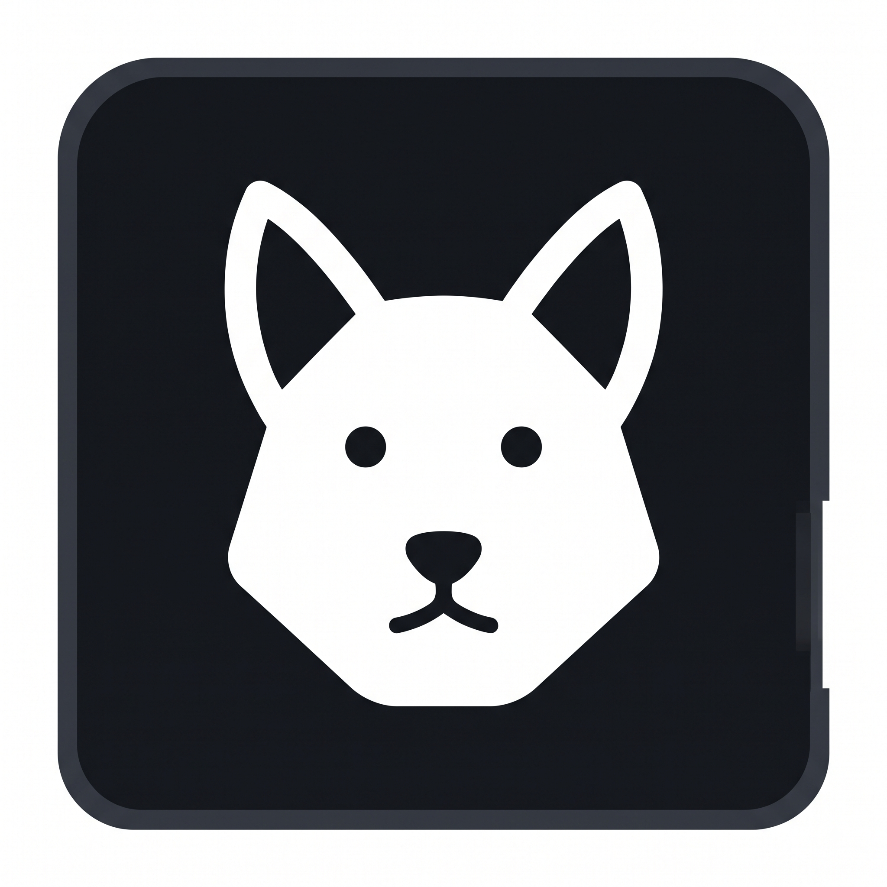
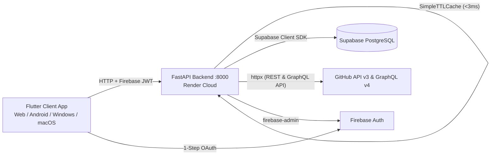

<p align="center">
  
</p>

<h1 align="center">🚀 Repo Dog</h1>

<p align="center">
  <b>Unified GitHub Activity Dashboard & Developer Workspace</b>
</p>

<p align="center">
  <a href="https://repo-dog.vercel.app/">
    
  </a>
  <a href="https://github.com/Ashu-sosuke/Repo-Dog/releases/latest">
    
  </a>
  <a href="https://github.com/Ashu-sosuke/Repo-Dog/stargazers">
    
  </a>
</p>

---

## 📌 Overview

**Repo Dog** is a modern, cross-platform developer workspace and GitHub tracker built with **Flutter**, **FastAPI**, **Supabase**, **GitHub REST & GraphQL APIs**, and **Firebase Authentication**.

Repo Dog unifies your entire GitHub footprint — profile metadata, GitHub profile README, repository lists, branch intelligence, commit histories, 53-week contribution heatmaps, PRs, CI/CD workflow runs, and repository READMEs — into a single, high-performance GitHub dark-themed dashboard.

---

## 🌐 Live Deployments & Downloads

- 🌐 **Web Dashboard (Vercel)**: [https://repo-dog.vercel.app](https://repo-dog.vercel.app/)
- 📱 **Android App (APK)**: [Download Latest Release APK](https://github.com/Ashu-sosuke/Repo-Dog/releases/latest)

---

## 🏗️ Architecture Overview



---

## ✨ Key Features

- **⚡ Ultra-Fast Double-Layer Caching Engine**:
  - **Backend TTL Cache (`SimpleTTLCache`)**: 5-minute in-memory response cache bringing API response times down to **<3ms**.
  - **Frontend State Retention (`ref.keepAlive()`)**: Instant tab switching across **Dashboard**, **All Repos**, **Description**, and **Settings**.
  - **Smart Invalidation**: Triggers clean cache purges automatically when a GitHub sync is executed.
- **🎨 GitHub Dark Aesthetic**: Tailored GitHub Dark theme (`#0D1117` canvas, `#161B22` sidebar, `#30363D` borders, `#58A6FF` accent blue, `#3FB950` contribution green).
- **🔑 1-Step GitHub Sign-In**: Seamless authentication via Firebase GitHub OAuth with PAT & Dev fallback modes across Web, Android, and Desktop.
- **📈 Live GraphQL Contribution Heatmap**: Fetches exact contribution calendar from GitHub GraphQL API (`contributionsCollection.contributionCalendar`), displaying total contributions and daily contribution intensity grid.
- **📦 All Repositories Explorer**: Filter repositories by **All**, **Public**, **Private**, or **Starred** with instant search, primary language dots, star/fork metrics, and relative update timestamps (*Updated 17m ago*).
- **📖 Live Repository README.md Viewer**: Displays full formatted Markdown for any repository directly inside the Overview tab.
- **🌱 Deduplicated Branch Intelligence**: Real-time list of repository branches sorted with Default branch first, exact UTC commit timestamps, and stale branch detection (`STALE >30d`).
- **👤 User Profile & Description (`/description`)**: Renders full GitHub profile metadata alongside your live **GitHub Profile README.md** (`username/username`).
- **⚙️ Active Settings Workspace (`/settings`)**:
  - **Force Re-Sync Engine**: Interactive manual sync trigger with live progress feedback.
  - **Background Sync Frequency**: Polling interval configuration (`15 Mins`, `1 Hour`, `6 Hours`, `Manual Only`).
  - **Stale Branch Threshold Slider**: Adjustable cutoff from `7` to `90` days.
  - **Live API Health Monitor**: Real-time server status badge (`🟢 API Online`).
  - **Sign Out Confirmation**: Modal dialog protection against accidental logouts.
- **🔒 Enterprise Security**: GitHub OAuth access tokens are encrypted at rest using **Fernet symmetric encryption** before storing in Supabase PostgreSQL.

---

## 🛠️ Technology Stack

| Layer | Technologies |
| :--- | :--- |
| **Frontend** | Flutter 3.x, Flutter Riverpod, GoRouter, Dio, Google Fonts (Outfit & Inter), Flutter Markdown |
| **Backend** | Python 3.11+, FastAPI, Uvicorn, httpx, Cryptography (Fernet), In-Memory TTL Cache |
| **APIs** | GitHub REST API v3 & GitHub GraphQL API v4 |
| **Database** | Supabase PostgreSQL (RLS-enabled schema) |
| **Auth** | Firebase Auth (GitHub OAuth Provider) |

---

## 📂 Project Structure

```
Repo Dog/
├── app/                        # Flutter multi-platform application (Web, Android, Desktop)
│   ├── android/                # Android native configuration & launcher icons
│   ├── assets/                 # App brand assets & logo.png
│   ├── lib/
│   │   ├── core/
│   │   │   ├── constants/      # ApiConstants (Base URL & Endpoint Routes)
│   │   │   ├── layout/         # AppShell (Responsive Navigation Sidebar & Bottom Bar)
│   │   │   ├── network/        # Dio Client & Firebase Auth Interceptor
│   │   │   ├── router/         # GoRouter navigation & route guards
│   │   │   └── theme/          # GitHub Dark Theme design system
│   │   ├── features/
│   │   │   ├── auth/           # AuthNotifier, LoginScreen, SyncLoadingScreen
│   │   │   ├── dashboard/      # DashboardScreen (Stats, Starred/Recent Repos, Heatmap)
│   │   │   ├── profile/        # DescriptionScreen (Profile Metadata & Profile README)
│   │   │   ├── projects/       # ProjectsScreen & ProjectDetailScreen (README & Branches)
│   │   │   └── settings/       # SettingsScreen (Sync Engine, Preferences, Stale Rules)
│   │   └── firebase_options.dart # Auto-generated FlutterFire configuration
│   └── pubspec.yaml            # Flutter dependencies
│
├── backend/                    # FastAPI Backend Service
│   ├── app/
│   │   ├── core/               # Config, Cache (TTL Engine), Security (Fernet), Supabase Client
│   │   ├── routers/            # Auth, Dashboard, Projects, User, Settings, Sync API endpoints
│   │   ├── services/           # GitHubSyncService (REST & GraphQL sync engine)
│   │   └── main.py             # FastAPI entrypoint & CORS configuration
│   ├── .env                    # Environment configuration
│   ├── render.yaml             # Render deployment configuration
│   └── requirements.txt        # Python dependencies
│
├── supabase/
│   └── migrations/             # Initial database schema SQL & RLS policies
├── vercel.json                 # Vercel deployment configuration for Flutter Web
└── logo.png                    # App branding logo
```

---

## ⚡ Quick Start Guide

### 1. Backend Setup (FastAPI)

```powershell
# Navigate to backend directory
cd backend

# Install dependencies
pip install -r requirements.txt

# Start the API dev server on port 8000
python -m uvicorn app.main:app --host 0.0.0.0 --port 8000 --reload
```

### 2. Frontend Setup (Flutter)

```powershell
# Navigate to app directory
cd app

# Install dependencies
flutter pub get
```

---

## 📱 Running Across Platforms

### 🌐 Web (Chrome)
```powershell
cd app
flutter run -d chrome
```

### 📱 Android Device
```powershell
# Forward port 8000 from phone over USB
adb reverse tcp:8000 tcp:8000

cd app
flutter run -d android
```

### 💻 Windows Desktop
```powershell
cd app
flutter run -d windows
```

---

## 📦 Building Production Releases

### 📱 Android APK
```powershell
cd app
flutter build apk --release
# Built file: app/build/app/outputs/flutter-apk/app-release.apk
```

### 🌐 Web (Vercel Deploy)
```powershell
cd app
flutter build web --release

# Deploy via Vercel CLI from project root
cd ..
npx vercel --prod
```

### 💻 Windows Desktop (.exe)
```powershell
cd app
flutter build windows --release
# Built binary: app/build/windows/x64/runner/Release/app.exe
```

## 🔒 Production Environment Setup (`backend/.env`)

Repo Dog is production-ready. For local development or deploying your own instance, copy `backend/.env.example` to `backend/.env` and supply your backend credentials:

```env
# ── Firebase Admin SDK Configuration ────────────────────────────────
FIREBASE_PROJECT_ID=repo-dog
FIREBASE_SERVICE_ACCOUNT_JSON=serviceAccountKey.json

# ── Supabase PostgreSQL Database Credentials ─────────────────────────
SUPABASE_URL=https://your-project.supabase.co
SUPABASE_SERVICE_ROLE_KEY=your-supabase-service-role-key

# ── GitHub OAuth 2.0 Provider Credentials ───────────────────────────
GITHUB_OAUTH_CLIENT_ID=your-github-client-id
GITHUB_OAUTH_CLIENT_SECRET=your-github-client-secret

# ── Token Encryption Key (Fernet AES-256 Symmetric Encryption) ─────
# Generate a key using: python -c "from cryptography.fernet import Fernet; print(Fernet.generate_key().decode())"
TOKEN_ENCRYPTION_KEY=your-32-byte-fernet-key
```

---

<p align="center">
  <b>Repo Dog</b> — Designed & Developed by <a href="https://github.com/Ashu-sosuke"><b>Ashutosh Kumar</b></a><br>
  <sub>Empowering developers with unified GitHub workspace intelligence & real-time telemetry.</sub>
</p>
